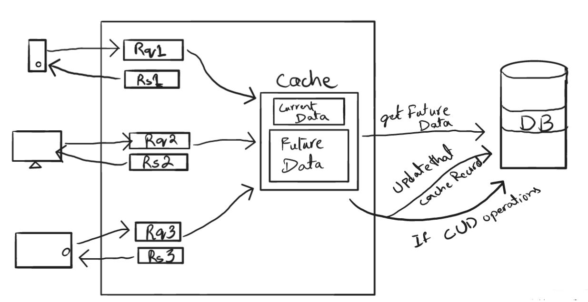

# future-cache
The idea is simple. 
To understand, we can divide the system in two modules. 
* Current Data (for later use)
* Future Data (for future requests)

## Current Data
The **Current Data** if not already stored in cache, will be accessed from DB and later stored in the cache, also will be sent as a response.
This will also emit a request to the DB for future data which will be discussed later.
We will have a limit to the number of users in the cache and if the cache is filled, the old users will be removed. 
Old users will also remove after a certain period of time automatically.

## Future Data
The **Future Data** is what we get from a emitted request and it gets a data from the DB and stores it in Cache, which will later become **Current Data**. 
_IF_ made any _**CUD**_(Create, Update, Delete) calls, the system will emit another request to update the record in the cache for that certain user.

## Raw Diagram

